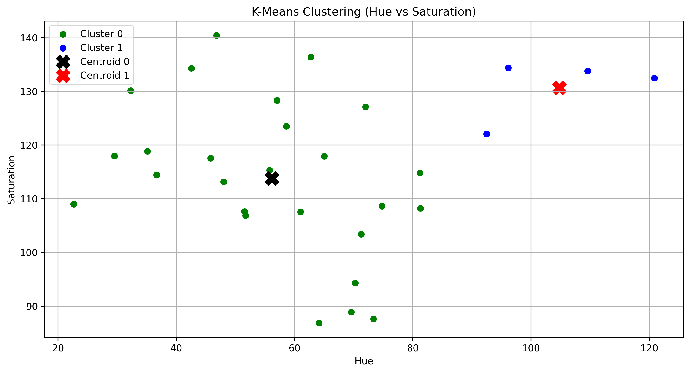
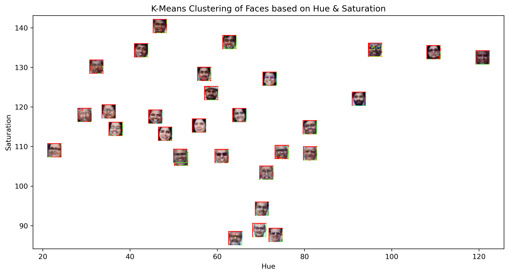
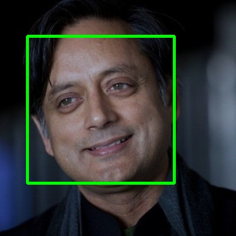
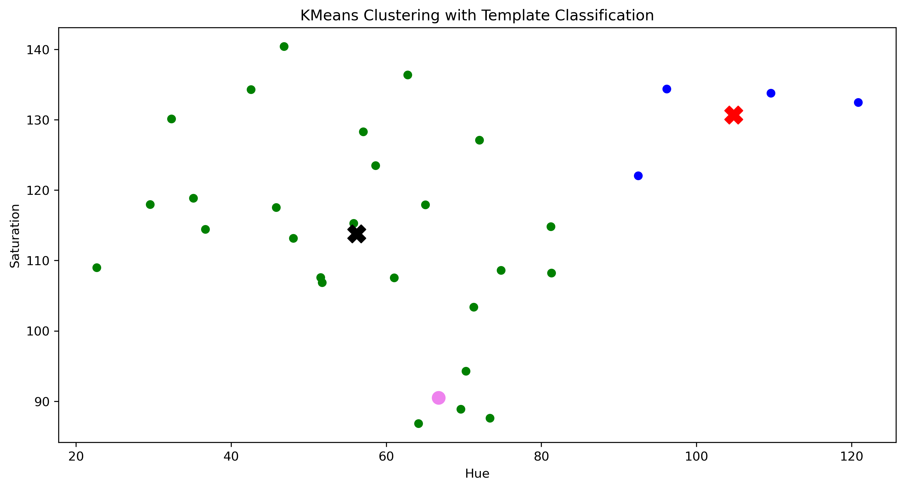

# LAB-5

<!DOCTYPE html>
<html lang="en">
<head>
  <meta charset="UTF-8">
</head>
<body>

  <h1 align="center">Face Clustering using Distance-Based Machine Learning</h1>

  <h2>Overview</h2>
  

    This project focuses on detecting faces in an image and grouping them based on visual
    similarity. After identifying faces, simple colour-based features are extracted and
    used to cluster similar faces using a distance-based K-Means algorithm. The project
    aims to explore how clustering techniques can be applied to computer vision problems.
  

  <h2>Objective</h2>
  <ul>
    <li>Detect human faces from an image</li>
    <li>Extract basic colour features from each detected face</li>
    <li>Group faces using K-Means clustering based on similarity</li>
    <li>Visualize face clusters in feature space</li>
    <li>Classify a new face image into an existing cluster</li>
  </ul>

  <h2>Approach</h2>

  <h3>1. Face Detection</h3>
  

    Faces are detected using the Haar Cascade classifier provided by OpenCV.
    Bounding boxes are drawn around each detected face to clearly identify
    the regions used for further processing.
  

  <h3>2. Feature Extraction</h3>
  

    Each detected face is converted from BGR to HSV colour space.
    The mean Hue and Saturation values are calculated and used as
    a two-dimensional feature vector to represent each face.
  

  <h3>3. Clustering</h3>
  

    K-Means clustering is applied to the extracted feature vectors.
    Faces with similar colour characteristics are grouped together
    based on distance similarity, and cluster centroids are computed.
  

  <h3>4. Template Face Classification</h3>
  

    A separate template face image is processed using the same pipeline.
    Its extracted features are compared with the trained clusters,
    and it is assigned to the closest cluster.
  

  <h3>5. Visualization</h3>
  

    Scatter plots are used to visualize the face clusters, their centroids,
    and the position of the template face in feature space. This visual
    representation helps in understanding how clustering behaves.
  

  <h2>Results and Visuals</h2>

  <h2>Observations</h2>
  <ul>
    <li>Distance-based clustering effectively groups visually similar faces</li>
    <li>Hue and Saturation provide a simple yet meaningful representation</li>
    <li>K-Means separates faces into clear clusters</li>
    <li>New face images can be classified into existing clusters</li>
  </ul>

  <h2>Conclusion</h2>
  

    This project shows how basic machine learning techniques can be applied
    to computer vision tasks. By combining face detection, feature extraction,
    clustering, and visualization, visually similar faces can be grouped
    without the need for labeled data.
  

  

    The experiment also highlights the importance of choosing appropriate
    features and distance measures, along with visualization, to better
    understand unsupervised learning behaviour.
  

</body>
</html>
